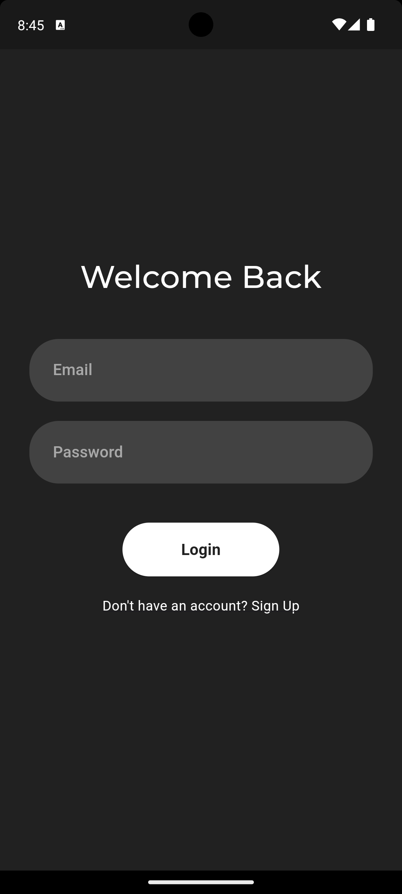
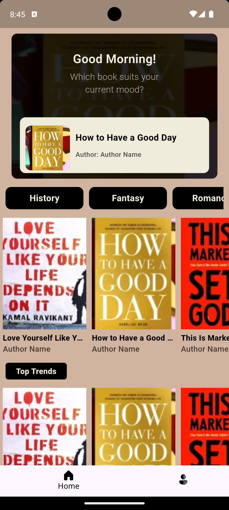
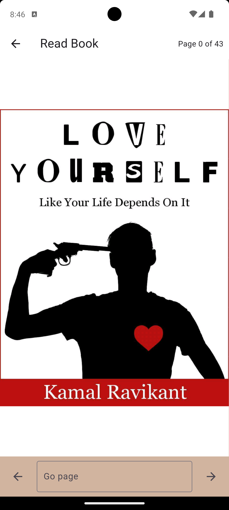

<h1 align="center">
   
  
   
  <b>Mindful-Reader</b>
   
</h1>
 

<!--  |  |  | 
---:|:---:|:---:|:--   -->

 

 
    Mindful Reader is an open-source Flutter application designed for reading books online. It provides a user-friendly interface for accessing and navigating digital book content. The app supports PDF file formats

## Key Features:

* PDF Reading: Seamlessly open and read PDF documents stored online.
* Navigation: Easily navigate through book chapters, sections, and pages using intuitive controls.

 

## Backend Requirements:

To utilize Mindful-Reader's full functionality, you'll need to deploy your own backend server

 

## Getting Started:
1. Clone the Repository: Download the project's source code from GitHub.

2. Set Up Backend: Deploy your chosen backend server and configure it to work with the app.
3. Run the App: Launch the Flutter project on your Android device or emulator.

 

## Contributing:
We welcome contributions from the community to enhance Mindful-Reader. Feel free to submit bug reports, feature requests, or code improvements.

 

## License:
Mindful-Reader is licensed under the MIT 

 
